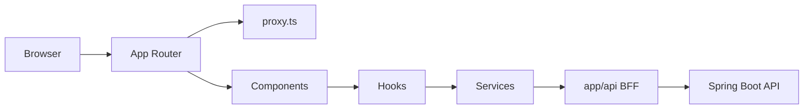

# AllanFlow Frontend
Frontend da plataforma AllanFlow, desenvolvido com Next.js para centralizar workspaces, boards Kanban, tarefas e colaboração em uma interface web moderna.

## Sobre o projeto
Este repositório contém o frontend da aplicação AllanFlow e atua como a camada de interface entre o usuário e o backend da plataforma.

A aplicação organiza a navegação pública, o fluxo de autenticação e toda a experiência operacional do produto. O frontend consome o backend por meio de uma camada BFF em `app/api`, mantendo a comunicação com a API centralizada e protegendo a navegação com cookies de sessão.

## Funcionalidades

- Landing page pública de apresentação do produto.
- Autenticação completa com email/senha e Google OAuth.
- Recuperação, redefinição e alteração de senha.
- Gerenciamento de workspaces, boards, membros e permissões.
- Sistema Kanban com criação, movimentação e organização de tarefas.
- Filtros, labels, clientes, comentários e checklists.
- Dashboard com indicadores do workspace.
- Convites de usuários por email.
- Assistente de IA integrado à interface.

## Arquitetura
O projeto usa **Next.js App Router** com route groups para separar a experiência pública da área autenticada.



Organização principal:
- `app/(public)`: login, cadastro, recuperação de senha, convite e landing page.
- `app/(protected)`: workspaces, boards, membros, clientes, configurações e conta.
- `app/api`: camada BFF que recebe as requisições do frontend e repassa para o backend.
- `components`: componentes compartilhados, como notificações e inputs reutilizáveis.
- `services`: integração com a API e com as rotas do BFF.
- `hooks`: estado e regras de negócio por feature.
- `types`: tipos de domínio por módulo.

Fluxo técnico:
- O cliente chama `app/api` via `axios` com base em `/api`.
- As rotas de `app/api` usam `API_URL` para falar com o backend real.
- O cookie `access_token` é lido no servidor quando necessário.
- O arquivo `proxy.ts` protege as rotas do App Router com base na presença do cookie.


## Tecnologias utilizadas
- Next.js 16.2.12
- React 19.2.4
- TypeScript
- Tailwind CSS 4
- Axios
- Framer Motion
- Lucide React
- React Markdown
- jwt-decode
- Docker
- ESLint

## Autenticação
O fluxo de autenticação é baseado em cookie de sessão e em rotas BFF do próprio Next.js.

Como funciona:
- O formulário de login envia `email` e `password` para `/api/login`.
- A rota BFF `app/api/login/route.ts` encaminha a requisição para o backend em `/auth/login`.
- Se o backend responder com `set-cookie`, o frontend repassa esse cookie para o navegador.
- O cookie usado no projeto é `access_token`.
- A rota `app/api/auth/me` lê o cookie, decodifica o JWT com `jwt-decode` e complementa os dados do usuário com a resposta do backend.
- O `proxy.ts` bloqueia acesso a rotas protegidas quando não há sessão e redireciona para `/login`.
- Quando o usuário já está autenticado, o `proxy.ts` evita acesso às rotas públicas de autenticação e envia para `/workspaces`.
- A rota de logout limpa o cookie de sessão.

Também há suporte a:
- login social via Google OAuth;
- redefinição de senha;
- alteração de senha na área autenticada.

## Docker
O projeto possui suporte a containerização com build multi-stage.

Pontos principais:
- `Dockerfile` usa Node 22 Alpine.
- O build recebe `API_URL` como argumento.
- O resultado final usa `output: standalone` do Next.js.
- A imagem expõe a porta `3000`.

Arquivos disponíveis:
- `docker-compose.prod.yml`: prepara o frontend atrás do Traefik, com domínio exemplo `flow.allandev.tech`.
- `docker-compose.local.yml`: expõe a porta `3000:3000` para uso local.

Exemplo de deploy com Docker:

```bash
docker compose -f docker-compose.prod.yml up --build
```

## Deploy
Em produção, o frontend é executado como aplicação standalone do Next.js dentro do container gerado pelo `Dockerfile`.

O arquivo `docker-compose.prod.yml` mostra a configuração usada para publicação:
- container `allanflow-frontend`;
- rede externa `proxy`;
- proxy reverso com Traefik;
- TLS via `letsencrypt`;

Na prática, o deploy depende de:
- imagem construída com `API_URL`;
- container servindo na porta `3000`;
- proxy reverso apontando para o serviço do frontend.

## Estrutura do projeto
Estrutura resumida das principais pastas:

```text
.
├── app
│   ├── (public)
│   ├── (protected)
│   ├── api
│   ├── config
│   ├── globals.css
│   └── layout.tsx
├── components
├── public
│   └── img
├── proxy.ts
├── next.config.ts
├── Dockerfile
└── docker-compose*.yml
```

## Segurança e boas práticas
- Headers de segurança definidos em `next.config.ts`.
- `X-Frame-Options: DENY`.
- `X-Content-Type-Options: nosniff`.
- `Referrer-Policy: strict-origin-when-cross-origin`.
- `Permissions-Policy` restringindo câmera, microfone e geolocalização.
- Cookies de autenticação tratados de forma `httpOnly`.
- Rotas protegidas bloqueadas antes da renderização por `proxy.ts`.
- Validações de formulário nos hooks e serviços por feature.
- Separação clara entre componentes, hooks, services e types.
- Comunicação com o backend centralizada em rotas BFF.
- Estado gerenciado localmente com React hooks e um provider apenas para notificações.

## Autor
AllanGaBRs

[LinkedIn](https://linkedin.com/in/allan-gabriel-moreira-da-silva-9090a9271)
